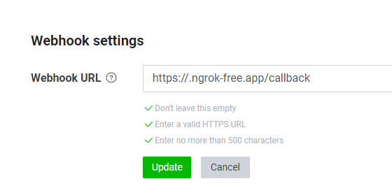

# For Windows 11 run guide

You must have Line Develpoer's account :
https://developers.line.biz/en/
(Set your account first)

Download repostory
```
git clone https://github.com/Steve900125/FengShuiLineChatBot.git
```

Install requirements package
```
pip install -r requirements.txt
```

Click "ngroke.exe"

Set your ngrok 
```
ngrok config add-authtoken xxYour-Tokenxxx
```

Open your port on 5000 (flask default)
```
ngrok http --domain=big-rattler-certainly.ngrok-free.app 5000
```

Set your call back route on MessagesAPI Webhook URL



Run the code
```
python main.py
```

